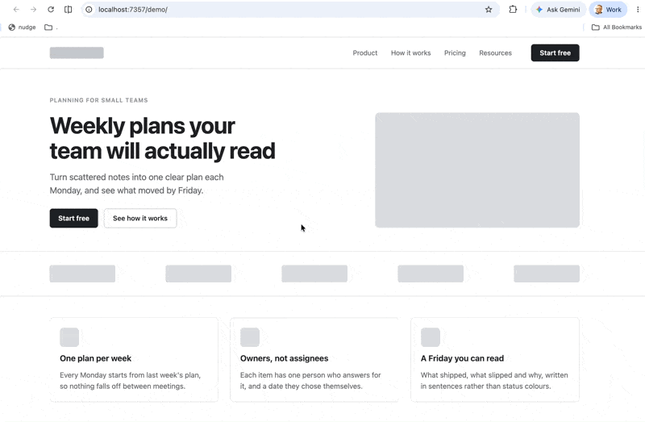
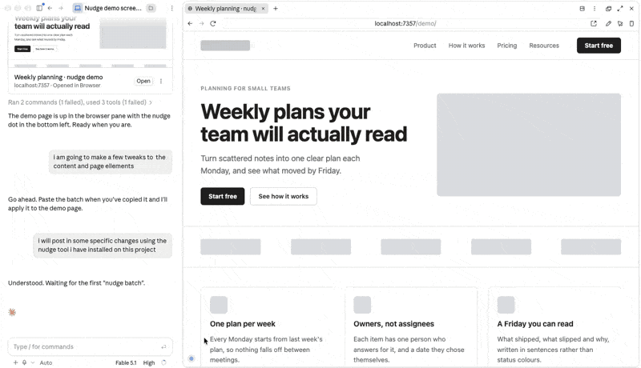

# nudge

Drag on the running page, then paste the measurements into your coding agent.

nudge reads the rendered page, so it works on anything you can open in a browser: Tailwind, CSS modules, styled-components, plain CSS, any framework or none.



## The problem

When you build a site with an agent, the last stretch is small visual corrections, and natural language is a bad instrument for them. You end up writing "the button on the right in the third section, the one with the pricing heading, move it under the button to its left and make it a little wider". That sentence takes longer to write than the change takes to make, and it is still ambiguous.

nudge replaces the sentence with measurements.

## What it is for

nudge is not where you design. It is where you correct.

It exists for the last stretch: the subhead capped too narrow, the image half a line off the text beside it, the gap that should match the one above. Everything it does is a small correction to something that already exists.

## How it works

You drag on the running page. nudge records what changed and what it lined up with. You copy a batch of plain text and paste it into your agent, and the agent edits the source.

nudge never writes to your files.

## Install: nudge in your main browser

Go to the [install page](https://g1d30nb.github.io/nudge/) and drag the link to your bookmarks bar. That is all.

A bookmark needs a bookmarks bar, so open the page you are working on in an ordinary browser such as Chrome, Safari or Firefox. That can be your local dev server or a live site. Claude Code's built-in browser has no bookmarks bar; to use nudge there, see [In your project](#putting-nudge-in-your-project) below.

There is no clone, no server, no npm, and nothing is added to your project. The bookmark loads `nudge.js` from jsDelivr when you click it. If you would rather make the bookmark by hand, paste this line as its URL:

```
javascript:(function(){if(window.__nudge){window.__nudge.destroy();return}var s=document.createElement('script');s.src='https://cdn.jsdelivr.net/gh/g1d30nB/nudge@v1.2.1/nudge.js?t='+Date.now();document.documentElement.appendChild(s)})();
```

It works on any page in the browser, including a live site. The batch is only useful if you have the source to hand.

<a id="putting-nudge-in-your-project"></a>
## In your project: use nudge in Claude Code's built-in browser

The [bookmark](https://g1d30nb.github.io/nudge/) is how to try nudge. There are two reasons to go further and put nudge in the project itself.

- **Claude Code's built-in browser has no bookmarks bar.** If you build with Claude Code and look at your work in its browser pane, there is nowhere to click a bookmark. With nudge in the project, the whole loop happens in one window: you drag in the pane, copy the batch, paste it into Claude Code beside it.
- **Daily use.** If you use nudge on one project every day, it is there on every page load without a click.

It is the same file and the same release, loaded a second way. Nothing separate, nothing experimental.

### What you get



Instead of the panel, a small blue dot in the bottom left corner of every page while you are developing. Click the dot to open nudge; close the panel and the dot comes back. Your bookmark still works on the same page: it opens the panel if the dot is showing and closes it if the panel is open. Option-click the dot to hide it until the page reloads, for screenshots.

### The easy way: ask Claude Code

You do not need to know which file to edit or what your framework's development switch is called. Claude Code does. Copy the whole block below and paste it into Claude Code as one message, in the project you are building:

```text
Add nudge to this project so that it loads only while I am developing.

nudge is a design-correction tool: https://github.com/g1d30nB/nudge. It is one script file. Add this tag to the layout or entry point that every page shares, so it is present when I run the dev server and absent from any production build:

<script src="https://cdn.jsdelivr.net/gh/g1d30nB/nudge@v1.2.1/nudge.js" data-nudge-dormant></script>

Rules:
- Keep the data-nudge-dormant attribute exactly as written. Without it nudge opens a panel on every page load.
- Guard the tag with this framework's own development flag (for example import.meta.env.DEV, process.env.NODE_ENV === 'development', or import.meta.dev), so it cannot reach a production build. Do not rely on a runtime check instead.
- If this project has a Content-Security-Policy that blocks outside scripts, download nudge.js from https://github.com/g1d30nB/nudge/releases/tag/v1.2.1 into the public folder and point the tag at /nudge.js instead.
- Change nothing else.
- When you are done, start the dev server, tell me which file you changed, and remind me that the small blue dot in the bottom left corner of the page opens nudge.
```

Then open your dev server in Claude Code's browser pane, or in any browser. The dot is in the bottom left corner. If you do not see it, ask Claude Code to check that the tag it added is on the page.

### Why it cannot go live

Two safeguards, and either one on its own is enough.

1. **The tag only exists in development.** The prompt tells Claude Code to wrap the tag in your framework's own development switch. When your site is built for real, that switch is off and the tag is not in the output at all. This is the real protection. Every snippet further down was checked the same way: the dev server shows the tag, the production build does not contain it.
2. **nudge refuses to run anywhere public.** Even if the tag somehow reached a live site, nudge checks the address it is running on. Loaded this way, it only works on `localhost`, `127.0.0.1`, `::1`, or an address ending in `.localhost` or `.local`, which are the addresses of a dev server on your own machine. Anywhere else it writes one line to the browser console and does nothing. Your bookmark is not subject to this check, because you use that on live sites on purpose.

If you want to see for yourself: on your live site, view the page source and search for `nudge`. It will not be there.

### To remove it

Paste this into Claude Code: `Remove nudge from this project: delete the script tag and any code you added to load it.`

### By hand, for each framework

If you would rather add it yourself, each snippet below uses that framework's own development flag. Each was checked on a fresh project: the dev server renders the tag, and the production build does not contain it.

<details>
<summary>Astro</summary>

In a layout, or `src/pages/index.astro`, before `</body>`. `is:inline` stops Astro bundling it.

```astro
{import.meta.env.DEV && <script is:inline src="https://cdn.jsdelivr.net/gh/g1d30nB/nudge@v1.2.1/nudge.js" data-nudge-dormant></script>}
```
</details>

<details>
<summary>Next.js, app router</summary>

In `app/layout.tsx`, inside `<body>` after `{children}`.

```tsx
{process.env.NODE_ENV === 'development' && (
  // eslint-disable-next-line @next/next/no-sync-scripts
  <script src="https://cdn.jsdelivr.net/gh/g1d30nB/nudge@v1.2.1/nudge.js" data-nudge-dormant="" />
)}
```
</details>

<details>
<summary>Vite with React</summary>

In `src/main.jsx` or `main.tsx`. Vite's `index.html` has no conditionals, so add the tag from code and let the build drop it.

```js
if (import.meta.env.DEV) {
  const s = document.createElement('script')
  s.src = 'https://cdn.jsdelivr.net/gh/g1d30nB/nudge@v1.2.1/nudge.js'
  s.setAttribute('data-nudge-dormant', '')
  document.body.appendChild(s)
}
```
</details>

<details>
<summary>SvelteKit</summary>

In `src/routes/+layout.svelte`. A `{#if dev}` block in markup keeps the tag out of the page but leaves the URL as dead text in the client bundle, so add it from code instead.

```svelte
<script lang="ts">
  import { onMount } from 'svelte';
  let { children } = $props();
  onMount(() => {
    if (import.meta.env.DEV) {
      const s = document.createElement('script');
      s.src = 'https://cdn.jsdelivr.net/gh/g1d30nB/nudge@v1.2.1/nudge.js';
      s.setAttribute('data-nudge-dormant', '');
      document.body.appendChild(s);
    }
  });
</script>

{@render children()}
```
</details>

<details>
<summary>Nuxt</summary>

In `app/app.vue` or `app.vue`.

```vue
<script setup lang="ts">
if (import.meta.dev) {
  useHead({ script: [{ src: 'https://cdn.jsdelivr.net/gh/g1d30nB/nudge@v1.2.1/nudge.js', 'data-nudge-dormant': '' }] })
}
</script>
```
</details>

<details>
<summary>Plain HTML with no build step</summary>

There is no build, so there is no development switch and no first safeguard. Put the tag before `</body>` and remove it before you deploy. The address check would stop nudge running on a live domain, but do not rely on it; take the line out.

```html
<script src="https://cdn.jsdelivr.net/gh/g1d30nB/nudge@v1.2.1/nudge.js" data-nudge-dormant></script>
```
</details>

<details>
<summary>Self-hosting, for projects that block outside scripts</summary>

Download `nudge.js` from the [release](https://github.com/g1d30nB/nudge/releases/tag/v1.2.1), put it in the project's public folder, and point the tag at `/nudge.js`. Same file, same guard, same attribute.

```html
<script src="/nudge.js" data-nudge-dormant></script>
```
</details>

Whichever way it is added, the `data-nudge-dormant` attribute is what makes nudge load as a dot rather than a panel, and what turns on the address check. Loading the file twice does nothing.

## Use it

- Click the bookmark to open nudge. Click it again to close it.
- Click an element to select it. Clicks select the deepest element under the pointer, so clicking an image selects the `img`, not its `figure`. Clicking inside a selected element selects what you clicked; dragging moves the selected element.
- **Hold Option and press the up arrow to select the parent** of the selected element: the wrapper around a heading, its copy and its image, which has no surface of its own to click. Press again for the next parent up. Option and the down arrow comes back. The panel's header shows what is selected each time.
- Drag inside the selection to move it. Pink guides appear when an edge lines up with another element; release on a guide and the relationship is recorded.
- Drag the right, bottom or corner handle to resize. The moving edge snaps to other elements' edges, and the width or height snaps when it matches another element's; a dashed box appears over the element you now match.
- Hold **Option** while resizing to lock the aspect ratio, so the element scales instead of stretching. On the corner handle, whichever direction you move further drives the size and the other follows.
- Arrow keys nudge 1px, Shift and an arrow nudges 10px. Backspace removes. Esc deselects.
- Double-click a selected element to edit its text in place. Escape or a click elsewhere finishes. Only elements with no child elements can be edited, and only as plain text; the batch reports the old string and the new one.
- With a text element selected, the panel shows its font size, line height, letter spacing and weight. Step them with the arrow keys or the small arrows that appear in each box: 1 at a time, 10 with Shift, a fine step with Option. A value that lands on another element's value snaps to it, and the batch says so: `font size 17px → 21px (now matches .lede)`.
- The panel also shows the element's text colour, and its background colour where it already has one. Click either to open a palette built from the colour tokens declared on `:root`, with the current token marked. The batch reports token names, such as `colour var(--ink-muted) → var(--ink)`. The colour picker under the palette is for anything else, and the batch then says no token matched that value.
- Hold Shift while dragging to disable snapping. Release with Shift held and no alignment is recorded; the move is taken as exact.
- Click the panel's header to collapse it to a single row while you work; the row shows how many changes you have made and keeps the Copy button. Click it again to see the list and the type and colour controls.
- Changes stay on the page as a preview. Each change has its own undo, and Reset clears them all.
- **Copy for Claude Code** puts the batch on the clipboard and marks those changes as sent: their rows dim and show a tick. The preview stays on the page, so if the paste does not take you can press **Re-copy**. Paste the batch into your agent as the whole message.
- Once your agent has applied the batch, press **Clear preview**. It removes nudge's preview so you see the page as your code now renders it.
- Changes you make after copying are copied on their own next time, so the agent never receives the same change twice. If you drag an element that is already marked sent, nudge clears its preview first and starts again from the live page, and says so.
- While nudge is open, links do not navigate and the right-click menu is suppressed. Close nudge before inspecting an element.

Work a section, copy, let the agent apply it, clear the preview, check the result, then move to the next section.

A hot reload that only swaps stylesheets leaves nudge's preview in place, which can make an agent's change look as if it worked when it did not. When that happens while changes are marked sent, the panel says "The page reloaded. Clear the preview to see the real result." A reload that rebuilds an element drops its preview instead.

## What it is good at

Precise small corrections, batched per section: a subhead capped too narrow, an image that should sit on the same baseline as the copy beside it, a card that should match its neighbour's width, an element that should not be there.

It tells the agent exactly what you want, and the agent still has to work out how to express that in your code.

## What the batch contains

A batch from the demo page after widening the hero subhead and dragging the portrait image down to the bottom of its text column:

```
nudge batch · http://localhost:4321/ · viewport 1440×900 · 2026-09-14 10:00

1. div.wrap.hero-inner > div.hero-copy > p.hero-subhead (src/components/Hero.astro:14:7) "Turn scattered notes into … what moved by Friday."
   width 400px → 558px (was capped by max-width: 400px)
   right edge aligned with right edge of div.wrap.hero-inner > div.hero-copy > p.hero-eyebrow "PLANNING FOR SMALL TEAMS"
   width matches width of div.wrap.hero-inner > div.hero-copy > p.hero-eyebrow "PLANNING FOR SMALL TEAMS" (558px)

2. section#how > div.wrap.split-inner > div.split-media (src/components/Split.astro:17:5)
   moved down 116px
   bottom edge aligned with bottom edge of section#how > div.wrap.split-inner > div.split-copy (src/components/Split.astro:9:5) "Built for the meeting you …a report nobody opens."

Apply these in source CSS and markup, in the files named above where given. Do not add inline styles.
A move that aligns with another element is a layout intent: express it with align-self, margin auto, grid placement or similar, never a transform or absolute offset.
Widths were measured at this viewport; keep them responsive (max-width or percentage) unless a fixed width is clearly correct.
```

Each entry names the element by its selector path and a snippet of its text, then lists what changed and what it now lines up with. The closing lines tell the agent how to translate those into CSS, and a batch only carries the lines that apply to it: no spacing guidance without an unaligned move, no removal guidance without a removal.

When an element was held back by a max-width the browser computed, from a clamp or a percentage, the batch says the element was capped at that size by a computed max-width and asks the agent to check the source, rather than quoting a value like 725.328px as if someone had written it.

The measurements and alignments are the same on every page. nudge takes them from the rendered layout, so nothing about your stack changes what it can capture.

The file path on each entry is the one exception. nudge can only print it where the framework puts source attributes in the page. Astro did this in dev mode up to version 6; Astro 7's new compiler does not, so on current Astro the agent gets the selector path and a text snippet and finds the file itself, which is the ordinary way an agent locates code. Reports from any stack are welcome, and there is [an open issue](https://github.com/g1d30nB/nudge/issues/6) for them.

The batch is plain text written for a coding agent. It has been used with Claude Code, which is why the button says so.

## How alignment is chosen

While you drag, any edge of the moving element within 5px of another element's edge snaps to it and shows a guide. Same-edge matches (bottom to bottom, left to left) win over cross-edge matches (top to bottom) unless the cross-edge one is more than 2px closer; ties go to the smaller element. On release the check runs again at 1px and only the axis you actually moved on is written to the batch, so a purely vertical drag never reports a left-edge alignment that was already true.

Resizing snaps too. The edge you are dragging snaps to other edges, and the size snaps to another element's size within 5px; the batch then says `width matches width of X (520px)`, which tells the agent the two belong together (a shared class, a shared max-width, the same grid column) rather than handing it a number. When an edge snap and a size snap disagree, the nearer wins and the other is kept only if it still holds.

Images, video, canvas, SVG and iframes have an intrinsic shape. Resize one off its ratio and the batch says so: `aspect ratio changed from 4.00:1 to 5.00:1; this distorts the image, set one dimension only`. Resize it with Option held and the batch says `aspect ratio kept, scaled to 125%`, which is the intent the agent needs: change one dimension and let the other follow, rather than pinning both.

## Limitations

- One viewport per batch. Every measurement is stamped with the viewport it was taken at; the agent decides whether the rule generalises.
- No write-back. nudge describes changes; it never edits files.
- A hot reload that rebuilds an element drops its preview. Copy before you save a file your dev server is watching.
- Resize handles are right, bottom and corner only.
- Text editing is plain text only, in elements with no child elements.
- No font family control. nudge cannot see which fonts are installed or loaded.
- Type values are read from the rendered page, so they are measured in pixels even when the source uses rem, em or clamp. The batch adds the rem equivalent for font size, the em equivalent for letter spacing and the ratio for line height, so the agent can match the source's units. A clamp() cannot be recovered.
- The colour palette only lists tokens declared on `:root`, and only from stylesheets the browser lets a page read. A stylesheet served from another site, for example a hosted design system on a CDN, cannot be read, so its tokens are invisible: the palette omits them and a colour that matches one is reported as matching no token. The panel says how many stylesheets it could not read.
- A native `<dialog>` opened with `showModal()`, or a popover, sits in the browser's top layer and covers nudge's panel and dot. Close it first.
- In dormant mode, an element a framework re-renders without a route change keeps its record until you clear the preview; only route changes drop records for removed elements.
- No multi-select.
- Pages with a Content-Security-Policy that blocks external scripts refuse the loader, and the bookmark does nothing.

## Where it is going

The open issues are the roadmap. Text editing, type and token-aware colour arrived in v1.1.0; adjusting the gap between elements is the one I most want next.

nudge will not gain the ability to add elements or change layout mode. It corrects what is there; it is not somewhere to build a page.

## Early days

nudge changes nothing on disk. Everything it does is inline styles and text on the page in front of you; Reset or a refresh clears them.

The change that lands in your code is the one your agent makes from the batch. Commit before you paste it, and read the diff, the same as any other agent edit.

This is a few days old and built around one person's workflow. Expect rough edges. If something breaks, or the batch was not precise enough for your agent to act on, open an issue and say what stack you were on. That is the most useful thing anyone can send.

## Contributing

Suggestions and pull requests are welcome. [Open issues](https://github.com/g1d30nB/nudge/issues) list the known gaps, and some are marked as good first issues.

The single most useful thing anyone can send is a report from a stack other than Astro: whether the batch was precise enough for your agent to find and edit the right file, and if not, what it got wrong. [This issue](https://github.com/g1d30nB/nudge/issues/6) collects those reports.

For code changes:

- Run `npm test` and keep it green.
- Add a case to `tests/fixture.html` and a spec to `tests/nudge.spec.mjs` for any new behaviour.
- Keep nudge to one file with no dependencies and no build step.

To work on nudge itself, serve this folder and use the development bookmarklet from `bookmarklet.txt`, which loads your local copy instead of the published one. It only works on http pages such as localhost, because browsers block an http script on an https page.

```
python3 -m http.server 7357 --bind 127.0.0.1
```

## Test

```
npm install
npx playwright install chromium
npm test
```

Forty-nine headless Chromium checks in `tests/nudge.spec.mjs`, one per row of the GOOD table in `CONTRACT.md`, run against `tests/fixture.html`. The fixture is served from `https://nudge.test/` by a Playwright route so clipboard APIs exist; no server or certificate is needed.

## Stack

One file, no build, no dependencies. Vanilla JS, inline styles, and `data-nudge` attributes that keep the tool's own DOM out of selection.

## Changes

See [CHANGELOG.md](CHANGELOG.md).

## Licence

MIT. See [LICENSE](LICENSE).
